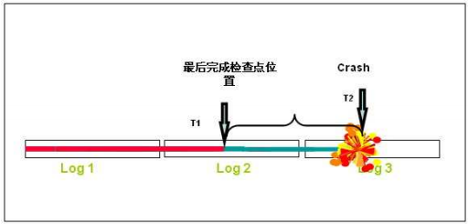

#Oracle checkpoint详解

============================================

##1 checkpoint扫盲

-----------------------
###什么是checkpoint

  在数据库系统中，写日志和写数据文件是数据库中IO消耗最大的两种操作，在这两种操作中写数据文件属于分散写，写日志文件是
顺序写，因此为了保证数据库的性能，通常数据库都是保证在提交（commit）完成之前要先保证日志都被写入到日志文件中，而脏数据块  
则保存在数据缓存（buffer cache）中再不定期的分批写入到数据文件中。也就是说日志写入和提交操作是同步的，而数据写入和提交  
操作是不同步的。这样就存在一个问题，当一个数据库崩溃的时候并不能保证缓存里面的脏数据全部写入到数据文件中，这样在实例启动  
的时候就要使用日志文件进行恢复操作，将数据库恢复到崩溃之前的状态，保证数据的一致性。检查点是这个过程中的重要机制，  
通过它来确定，恢复时哪些重做日志应该被扫描并应用于恢复。

   一般所说的checkpoint是一个数据库事件（event），checkpoint事件由checkpoint进程（LGWR/CKPT进程）发出，
当checkpoint事件发生时DBWn会将脏块写入到磁盘中，同时数据文件和控制文件的文件头也会被更新以记录checkpoint信息。

###checkpoint的作用

checkpoint主要2个作用：

1. 保证数据库的一致性，这是指将脏数据写入到硬盘，保证内存和硬盘上的数据是一样的；
2. 缩短实例恢复的时间，实例恢复要把实例异常关闭前没有写出到硬盘的脏数据通过日志进行恢复。如果脏块过多，实例恢复的时间也会很长，检查点的发生可以减少脏块的数量，从而提高实例恢复的时间。

通俗的说checkpoint就像word的自动保存一样。

###检查点分类

* 完全检查点（Normal checkpoint）  
* 增量检查点（Incremental checkpoint）

##2 checkpoint 工作图

---

  

  上图标记了3个日志组，假定在`T1`时间点，数据库完成并记录了最后一次检查点，在`T2`时刻数据库`Crash`。`T1`时间点之前的Redo  
不再需要进行恢复，Oracle需要重新应用的就是时间点T1至T2之间数据库生成的重做日志（Redo）。

上图可以很轻易地看出来，检查点的频率对于数据库的恢复时间具有极大的影响，如果检查点的频率高，那么恢复时需要应用的重做日志就相对得少，检查时间就可以缩短。然而，需要注意的是，数据库内部操作的相对性极强，国语平凡的检查点同样会带来性能问题，尤其是更新频繁的数据库。所以数据库的优化是一个系统工程，不能草率。

更进一步可以知道，如果Oracle可以在性能允许的情况下，使得检查点的SCN主键逼近Redo的最新更新，那么最终可以获得一个最佳平衡点，使得Oracle可以最大化地减少恢复时间。

为了实现这个目标，Oracle在不同版本中一直在改进检查点的算法。

